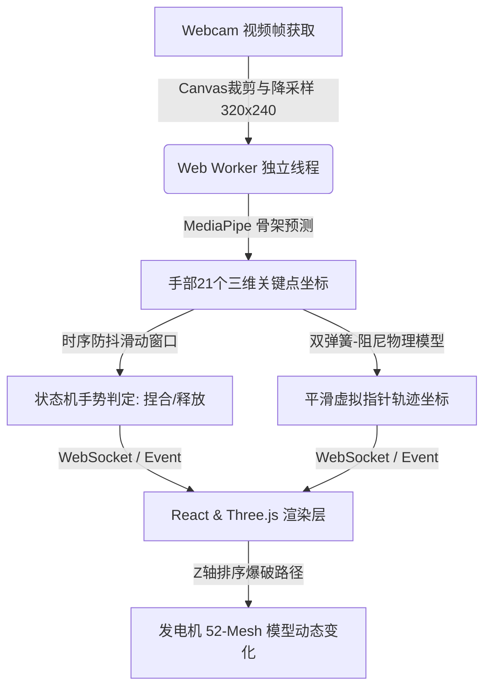
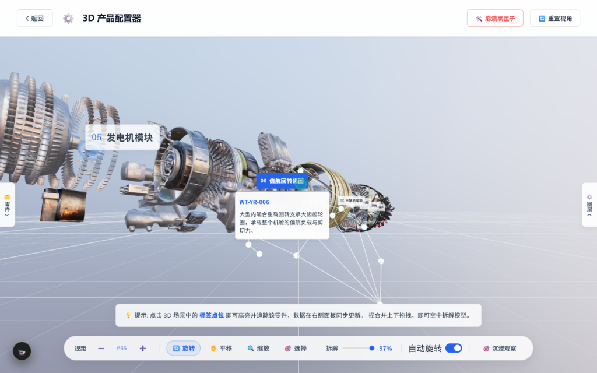
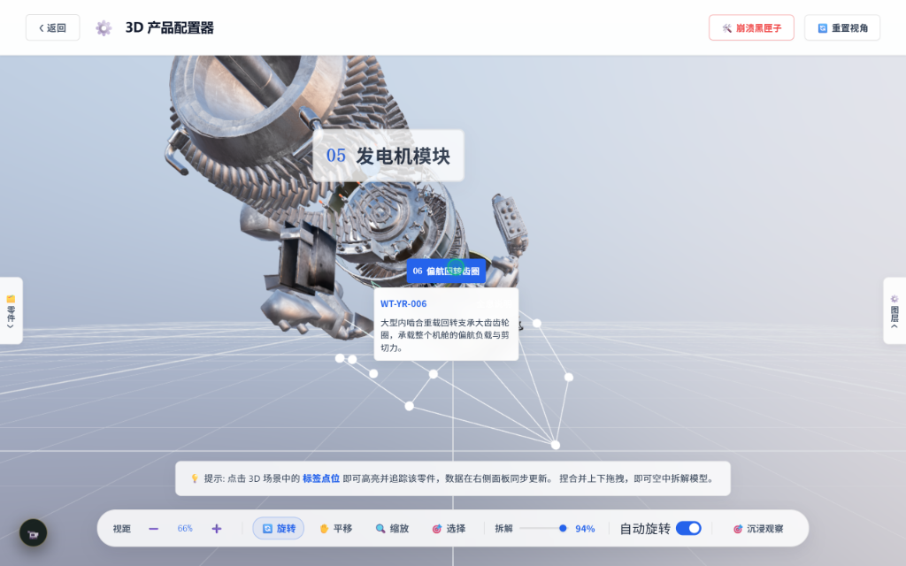
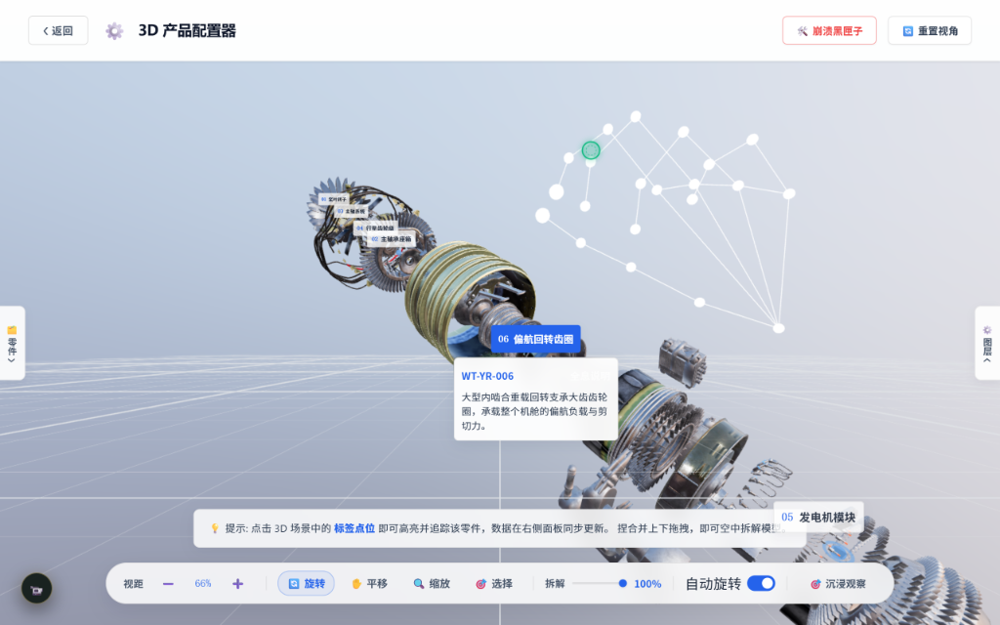

# 🌌 Spatial 3D Hand-Gesture Configurator & Exploded View
### (基于Webcam的网页端空间3D手势控制与零件拆解配置系统)

<p align="center">
  <a href="https://github.com/Singularity-Ye/spatial-3d-configurator">
    
  </a>
  
  
  
</p>

本项目为纯网页端 3D 产品配置系统，使用户能够仅基于**普通 Webcam 摄像头**，通过自然的**三维空间手势**在实时渲染的 WebGL 场景中对极其复杂的工业零件装配体（包含 52 个 Mesh 组件的风力发电机）进行无接触式的旋转、缩放、爆炸图拆解与属性配置。

---

## 🛠️ 功能模块一览

| 功能模块 | 描述 |
| :--- | :--- |
| **🖐️ 空间手势识别** | 基于 MediaPipe 边缘端轻量级推理，高精度提取手部 21 个骨架关键点的三维坐标 |
| **🎛️ 双弹簧-阻尼平滑** | 建立虚拟光标与物理关节的动力学平滑算法，完全消除摄像头采集的高频噪音与手部细微震颤 |
| **💥 Z轴单调拆解算法** | 首帧进行装配体排序，沿主轴单调展开 52 个 Mesh 发电机零件，彻底规避展开穿模与重叠 |
| **🛡️ 状态机时序消抖** | 滑动窗口时序防抖，设定 250ms 悬停确认容错期，有效防止手势短暂闪烁引发误操作 |
| **🖥️ 极速本地数据流** | 本地直接读取加载 33.5MB 的 GLTF 工业装配模型，无需依赖任何网络加速，秒开体验 |
| **🔌 异步多线程优化** | 将 MediaPipe 识别管线拆分至独立的 Web Worker 运行，确保 UI 线程 3D 渲染帧率稳定 60FPS |

---

## 🚀 核心算法设计

### 1. 运动学双弹簧-阻尼平滑算法 (Kinematic Double Spring-Damper Denoising)
为了解决摄像头图像采集带来的高频像素抖动，指针轨迹在帧循环中建立了一个基于胡克定律与粘性阻尼的物理力学模型。
利用欧拉积分（Euler Integration）在帧循环中计算每一帧指针的位移：

$$F_{\text{spring}} = -k \cdot (x_{\text{pointer}} - x_{\text{hand}})$$

$$F_{\text{damping}} = -c \cdot v_{\text{pointer}}$$

$$a_{\text{pointer}} = \frac{F_{\text{spring}} + F_{\text{damping}}}{m}$$

这赋予了空间光标自然的**惯性跟随与减震滑行**体验，使手势轨迹细腻、平滑，极大地增强了三维场景内的定位精度。

### 2. Z轴单调组件爆破算法 (Z-order Monotonic Component Explosion)
工业装配模型的拆解最忌讳零件展开时的轨迹交错与碰撞穿模。本系统在首帧加载时对发电机的 52 个子 Mesh 沿中心轴线位置进行惰性升序排序。手势捏合拉伸时，各组件以中位数零件为中心，单调向两端进行位移展开：

$$\vec{x}_{i,\text{offset}} = \vec{x}_{i,\text{original}} + \text{sign}(z_i - z_{\text{median}}) \cdot \text{scale} \cdot \vec{d}$$

这保证了爆破展开时空间结构的整洁性与装配走向的直观性。

## 🖐️ 直觉式三维手势交互设计

为了让用户无需接触屏幕即可流畅控制发电机模型，系统构建了一套基于手势姿态特征提取的控制原语映射：

```text
  手势状态 (Gesture)           触发动作 (Interaction)
 ┌───────────────┐           ┌────────────────────────────────┐
 │ ✊ 单手握拳    │ ───────► │ 模型三维旋转拖拽 (Orbit Rotate)  │
 ├───────────────┤           ├────────────────────────────────┤
 │ 🤏 单手捏合    │ ───────► │ 选中与聚焦 Hover 零件 (Select) │
 ├───────────────┤           ├────────────────────────────────┤
 │ 👐 双手间距    │ ───────► │ 爆炸图拆解深度控制 (Explosion) │
 ├───────────────┤           ├────────────────────────────────┤
 │ 🖐️ 单手张开    │ ───────► │ 悬停 0.8s 重置全部选中 (Cancel)  │
 ├───────────────┤           ├────────────────────────────────┤
 │ ✊✊ 双手握拳  │ ───────► │ 悬停 0.8s 恢复主视角 (Reset)   │
 └───────────────┘           └────────────────────────────────┘
```

*   **三维旋转拖拽 (Orbit Rotate)**：当识别到**单手握拳 (Fist)** 且无双手事件时，系统锁定光标，将手部空间位移增量映射为 WebGL 摄像头的环绕轨道旋转，实现直观的拨动模型体验。
*   **零件定位选中 (Select)**：单手食指和大拇指**捏合 (Pinch)** 瞬间，发出三维射线（Raycaster）探测当前光标下的 Mesh 实例，高亮发电机子组件并展示其属性卡片。
*   **爆炸拆解深度 (Explosion)**：当识别到**双手 (Two-handed)** 姿态时，计算双手手掌中心（Landmark 9）的实时欧氏距离（Euclidean Distance）。双手水平向外侧拉伸，线性映射增加 52 个零件的 Z 轴平移展开距离，合拢双手则收回。
*   **重置机制的防误触设计**：
    *   **单手五指张开 (Palm)**：触发状态机 0.8 秒延时判定（防止翻转手掌时的误判），一键清理当前所有高亮与聚焦。
    *   **双手同时握拳 (Two-handed Fist)**：持续握拳 0.8 秒后快速归位摄像头视角与缩放，方便用户重新开始装配演示。

---

## 📅 系统架构与数据流



---

## 📂 项目结构说明

```text
src/
  ├── components/
  │     └── HandOverlay.jsx     # 摄像头视频采集、关键点可视化渲染叠加层
  ├── pages/
  │     └── SpatialUI.jsx       # 核心 3D 场景渲染、52个Mesh装配体层级与爆破路径控制
  └── App.jsx                   # 应用主入口与多线程 Worker 初始化
public/
  └── model/
        └── glb/
              └── turbine.glb   # 52组件发电机原装 33.5MB GLTF 三维模型
```

---

## 💻 快速开始

### 1. 环境准备
确保本地安装了 **Node.js** (推荐 v18 及以上版本)。

### 2. 安装依赖
在项目根目录下打开终端，运行：
```bash
npm install
```

### 3. 本地启动
启动开发服务器：
```bash
npm run dev
```
在浏览器中访问 [http://localhost:5173/](http://localhost:5173/)。允许使用摄像头，将手掌伸入摄像头视野内，即可开始隔空手势拆解与配置！

---

## 🖼️ 运行效果展示 (Visual Showcase)

### 💥 1. 发电机装配体 - 隔空爆破拆解 (Z-order Explosion View)
> **通过检测双手水平距离，隔空线性拉伸零件展开深度。右下角实时渲染 MediaPipe 提取的 21 点手部骨骼模型。**


### 🔄 2. 三维视图拖拽与零件悬停 (Orbit Rotate & Component Hover)
> **单手握拳（Fist）隔空拨动模型，即可实现 WebGL 视角的无阻碍旋转。高亮悬停零件，并在中心显示发电机子组件（如偏航回转齿圈）的详细工业参数卡片。**


### 📈 3. 发电机 100% 极限拆解状态 (Full Exploded View & Hand Overlay)
> **当双手拉伸至最大跨度时，发电机 52 个 Mesh 组件沿 Z 轴主轨完全爆破展开，内部的定子、转子、主轴承、冷却管道等组件排布纤毫毕现。**

